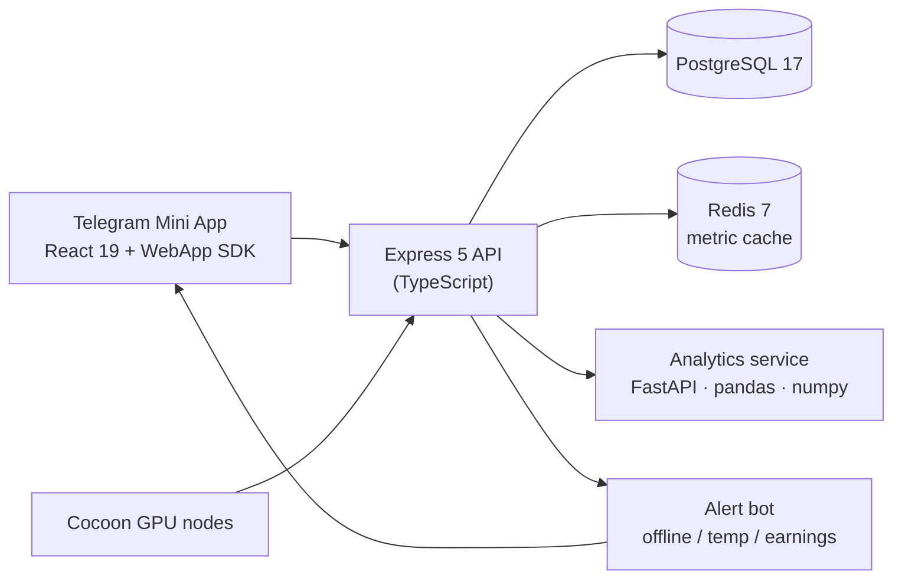

<div align="center">


<p>
  
  
  
  
  
</p>

<p><strong>Monitor and manage your GPU nodes on the Cocoon network — live metrics, earnings, and alerts, inside Telegram.</strong></p>

</div>

---

## Table of contents

- [Features](#features)
- [Architecture](#architecture)
- [Tech stack](#tech-stack)
- [Getting started](#getting-started)
- [License](#license)

---

## Features

| | Feature | Description |
|---|---|---|
| 📊 | **Real-time node monitoring** | GPU utilization, VRAM, temperature, uptime, and TEE status across all nodes with live-updating metrics. |
| 💰 | **Earnings dashboard** | Daily / weekly / monthly / all-time earnings with trend sparklines and animated counters. |
| 📈 | **Engagement analytics** | A dedicated Python service computes DAU/MAU ratios, retention cohorts, and task-completion rates. |
| 🎛️ | **Node management** | Start, stop, and restart GPU nodes directly from the Mini App. |
| 🔔 | **Alert system** | Telegram notifications when a node goes offline, exceeds a temperature threshold, or earnings drop unexpectedly. |
| 🔗 | **TON Connect** | Wallet linking via the official Telegram WebApp SDK. |

---

## Architecture



---

## Tech stack

| Layer | Technology |
|-------|------------|
| Frontend | React 19, TypeScript, Vite 7, Tailwind CSS 4, Zustand, Framer Motion |
| Telegram | `@telegram-apps/sdk-react`, `@tonconnect/ui-react` |
| Charts | Recharts + inline sparklines |
| Backend | Express 5 (via `tsx`), PostgreSQL 17 (`pg`), Redis 7 (`ioredis`) |
| Alerts | Telegram bot (`alertBot.ts`) |
| Analytics | Python 3.12, FastAPI, pandas, numpy (port 8080) |

---

## Getting started

### Prerequisites

- Node.js 20+ · Python 3.12+ · PostgreSQL 17 + Redis 7 (or Docker Compose)

### Install & run

```bash
git clone https://github.com/beepboop2025/cocoon-pulse.git
cd cocoon-pulse
npm install
```

Run the services (separate terminals):

```bash
npm run dev       # frontend  → http://localhost:5173
npm run server    # backend   → http://localhost:3001
npm run bot       # Telegram alert bot

cd analytics && pip install -r requirements.txt && python main.py   # analytics → :8080
```

### Docker Compose

```bash
cp .env.example .env     # set Telegram bot token + Cocoon API key
docker compose up --build
```

---

## License

MIT

---

<div align="center">
<sub>part of the <b>beepboop2025 intelligence stack</b> — systems that make opaque worlds legible</sub>
<br/><br/>

🛰 <a href="https://github.com/beepboop2025/social-scraper">social-scraper</a> ·
<a href="https://github.com/beepboop2025/palimpsest-china-intel">palimpsest</a> ·
📈 <a href="https://github.com/beepboop2025/DragonScope">DragonScope</a> ·
<a href="https://github.com/beepboop2025/LiquiFi">LiquiFi</a> ·
⚙ <a href="https://github.com/beepboop2025/pdf-toolkit-mcp">pdf-toolkit-mcp</a> ·
<a href="https://github.com/beepboop2025/snapmock">snapmock</a>
</div>
