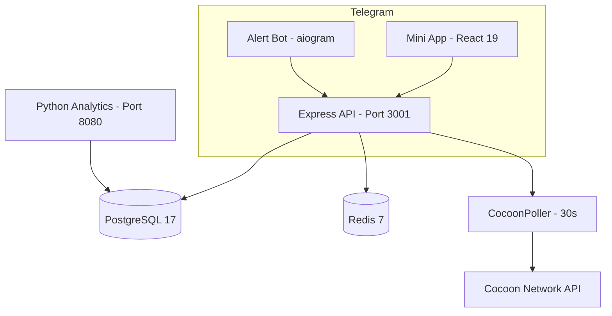

# CocoonPulse

**Monitor your GPU nodes from Telegram. Real-time metrics, earnings tracking, and alerts — all inside a Mini App.**


<!-- Add screenshot or demo GIF here -->
> Replace this with a screenshot of the dashboard inside Telegram showing GPU metrics and earnings

---

## The Problem

Running GPU nodes on the Cocoon network means checking multiple dashboards, missing downtime alerts, and losing track of earnings across nodes.

**CocoonPulse puts everything in Telegram** — GPU utilization, temperature, earnings, and alerts in a native Mini App. Get notified the moment a node goes offline or overheats.

---

## Table of Contents

- [Features](#features)
- [Quick Start](#quick-start)
- [Architecture](#architecture)
- [Tech Stack](#tech-stack)
- [Configuration](#configuration)
- [Roadmap](#roadmap)

---

## Features

| | Feature | Description |
|---|---------|-------------|
| :computer: | **Node Monitoring** | Real-time GPU utilization, VRAM, temperature, uptime, TEE status |
| :moneybag: | **Earnings Tracker** | Daily/weekly/monthly/all-time earnings with projections |
| :bar_chart: | **Analytics** | Task heatmap, network rank, performance recommendations |
| :bell: | **Alert System** | Node offline, temperature threshold, earnings drop, TEE failure |
| :iphone: | **Telegram Native** | Mini App + Bot commands (`/start`, `/status`, `/alerts`) |
| :gem: | **TON Connect** | Link your TON wallet for earnings verification |
| :chart_with_upwards_trend: | **Engagement Metrics** | DAU/MAU, retention cohorts, task completion rates (Python engine) |

---

## Quick Start

### Docker (Recommended)

```bash
git clone https://github.com/beepboop2025/cocoon-pulse.git
cd cocoon-pulse

cp .env.example .env
# Edit .env with your Telegram bot token and Cocoon API key

docker compose up --build
```

### Local Development

```bash
# Frontend
npm install
npm run dev          # http://localhost:5173

# Backend (separate terminal)
npm run server       # http://localhost:3001

# Bot (separate terminal)
npm run bot          # Telegram polling

# Analytics (optional)
cd analytics
pip install -r requirements.txt
python main.py       # http://localhost:8080
```

---

## Architecture



**4 services**: React frontend, Express API, Telegram bot, Python analytics engine. The `CocoonPoller` polls the Cocoon API every 30 seconds, stores metrics in PostgreSQL, caches in Redis (60s TTL), and triggers alerts via the bot.

---

## Tech Stack

| Layer | Technology |
|-------|-----------|
| Frontend | React 19, Vite 7, Tailwind CSS 4, Zustand, Recharts |
| Telegram | @telegram-apps/sdk-react, TON Connect |
| Backend | Express 5, PostgreSQL 17 (pg), Redis 7 (ioredis) |
| Analytics | Python FastAPI, Pandas, NumPy |
| Bot | Telegram long-polling (alertBot.ts) |
| Deploy | Docker Compose (4 services) |

---

## Configuration

| Variable | Description |
|----------|-------------|
| `VITE_TELEGRAM_BOT_TOKEN` | Telegram bot token (from @BotFather) |
| `VITE_COCOON_API_KEY` | Cocoon Network API key |
| `VITE_TON_CENTER_API_KEY` | TON Center API key (optional) |
| `DATABASE_URL` | PostgreSQL connection string |
| `REDIS_URL` | Redis connection string |
| `TELEGRAM_BOT_TOKEN` | Backend bot token |
| `COCOON_API_URL` | Cocoon API base URL |

---

## Roadmap

- [ ] Multi-node fleet comparison dashboard
- [ ] Earnings prediction model based on historical performance
- [ ] Push notifications via Telegram for critical alerts
- [ ] Node auto-restart integration via SSH
- [ ] Public leaderboard for top node operators
